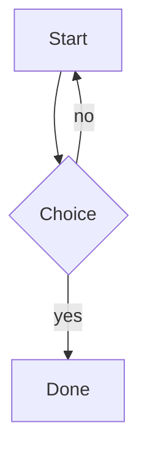

# Rendering Demo

Links to [[Note A]] so this note is not an orphan.

## Callout

> [!tip] Try this
> Callouts render as styled blocks.

> [!warning]- Folded warning
> Hidden until expanded.

## Code

```rust
fn main() {
    println!("highlighted");
}
```

## Math

Inline $E = mc^2$ and block:

$$
\int_0^1 x^2 \, dx = \frac{1}{3}
$$

## Diagram



## Media

![[pixel.png]]

==Highlighted text== and %%a hidden comment%% end here.

## Transclusion

![[Note B#Section One]]
